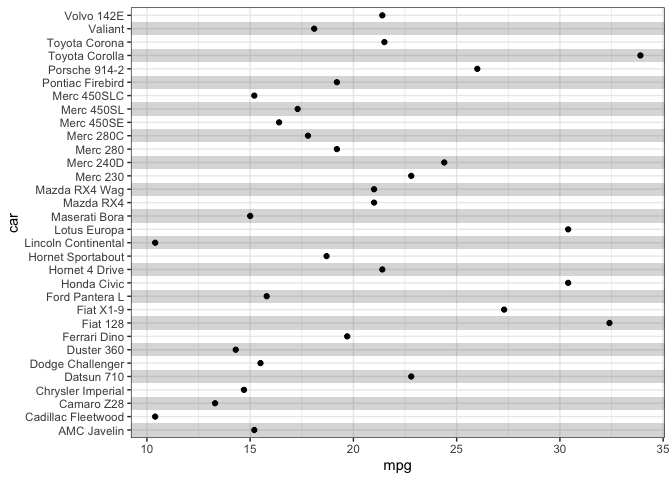

# background stripes for ggplot2

Often times in large plots with discrete x/y axis, it is difficult to
see which row belongs to which sample. A typical solution are
alternating background shades to help the reader.

This package implements these. Credit goes to the
[ggforestplot](https://github.com/nightingalehealth/ggforestplot)
package whose code I used as a starting point.

# Installation

The package can be can be installed via
`devtools::install_github('https://github.com/karchern/ggstripes/tree/main')`

# Usage

The package provides a single function `geom_stripes` which can be used
like any other geom in ggplot2.

It only works if the scale is discrete.

``` r
library(ggplot2)
library(ggstripes)
mtcars$car <- rownames(mtcars)
```

``` r
ggplot(data = mtcars
, aes(x = car, y = mpg)) +
    geom_stripes_vertical(odd = "#33333333", even = "#00000000")  +
    geom_point() +
    theme_bw()
```

<!-- -->

``` r
ggplot(data = mtcars 
, aes(x = mpg, y = car)) +
    geom_stripes_horizontal(odd = "#33333333", even = "#00000000") +
    geom_point() +
    theme_bw()
```

<!-- -->

It also works with faceting:

``` r
mtcars$group <- as.factor(sample(c('a', 'b', 'c'), size = nrow(mtcars), replace = TRUE))
ggplot(data = mtcars
, aes(x = mpg, y = car)) +
    geom_stripes_horizontal(odd = "#33333333", even = "#00000000") +
    geom_point() +
    facet_grid(group ~ .) + 
    theme_bw()
```

<!-- -->
